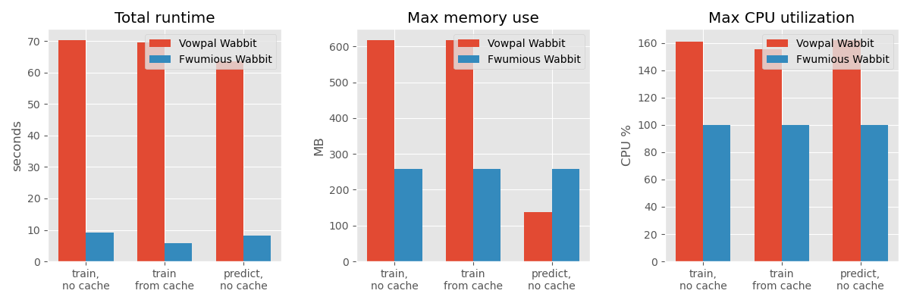

## Scenarios
1. train a new model from a gzipped dataset, generating a gzipped cache file for future runs, and an output model file - *this is a typical scenario in our AutoML system - we start by generating the cache file for the next runs.*
1. train a new model over the dataset in the gzipped cache, and generate an output model - *this is also a typical scenario - we usually run many concurrent model evaluations as part of the model search*
1. use a generated model to make predictions over a dataset read from a text file, and print them to an output predictions file - *this is to illustrate potential serving performance, we don't usually predict from file input as our offline flows always apply online learning. note that when running as daemon we use half as much memory since gradients are not loaded - only model weights.*


## Model

We train a logistic regression model, applying online learning one example at a time (no batches), 

using '--adaptive' flag for adaptive learning rates (AdaGrad variant).

### Results
here are the results for 3 runs for each scenario, taking mean values:



Scenario|Runtime (seconds)|Memory (MB)|CPU %
----|----:|----:|----:
vw train, no cache|67.72 | 562 | 172.87
fw train, no cache|9.47 | 258 | 101.93
vw train, using cache|52.76 | 554 | 177.30
fw train, using cache|6.76 | 258 | 101.50
vw predict, no cache|44.54 | 135 | 181.50
fw predict, no cache|4.25 | 258 | 101.57


### Model equivalence
loss values for the test set:
```
Vowpal Wabbit predictions loss: 0.5738
Fwumious Wabbit predictions loss: 0.5639
```


for more details on what makes Fwumious Wabbit so fast, see [here](https://github.com/outbrain/fwumious_wabbit/blob/benchmark/SPEED.md)
### Dataset details
we generate a synthetic dataset with 10,000,000 train records ('train.vw'), and 10,000,000 test records ('easy.vw').

the task is 'Eat-Rate prediction' - each record describes the observed result of a single feeding experiment.

each record is made of a type of animal, a type of food (in Vowpal Wabbit jargon these are our namespaces A and B respectively), and a label indicating whether the animal ate the food.

the underlying model is simple - animals are either herbivores or carnivores,
and food is either plant based or meat based.
herbivores always eat plants (and only plants), and carnivores always eat meat (and only meat).

we name animals conveniently using the pattern 'diet-id', for example 'Herbivore-1234' and 'Carnivore-5678',
and the food similarly as 'food_type-id' - for example 'Plant-678'
 and 'Meat-234' so the expected label for a record is always obvious.

there are 1,000 animal types, and 1,000 food types.


see for example the first 5 lines from the train dataset (after some pretty-printing):

label|animal|food
----:|------|----
-1 |A Herbivore-65 |B Meat-120
1 |A Herbivore-807 |B Plant-53
1 |A Herbivore-443 |B Plant-155
-1 |A Carnivore-272 |B Plant-184
1 |A Carnivore-230 |B Meat-325


### Feature engineering
if we train using separate 'animal type' and 'food type' features, the model won't learn well, 
since knowing the animal identity alone isn't enough to predict if it will eat or not - and the same 
goes for knowing the food type alone.

so we apply an interaction between the animal type and food type fields.

## Prerequisites and running
you should have Vowpal Wabbit installed, as the benchmark invokes it via the 'vw' command.
additionally the rust compiler is required in order to build Fwumious Wabbit (the benchmark invokes '../target/release/fw') 
in order to build and run the benchmark use one of these bash scripts:
```
./run_with_plots.sh
```
in order to run the benchmark and plot the results (requires matplotlib, last used with version 2.1.2)

or, if you just want the numbers with less dependencies run:
```
./run_without_plots.sh
```

## Latest run setup

### CPU Info
```
Physical cores: 28
Total cores: 56
Current Frequency: 1043.13Mhz
```
### System Information
```
System: Linux
Version: #102-Ubuntu SMP Mon May 11 10:07:26 UTC 2020
Machine: x86_64
Processor: x86_64
```
